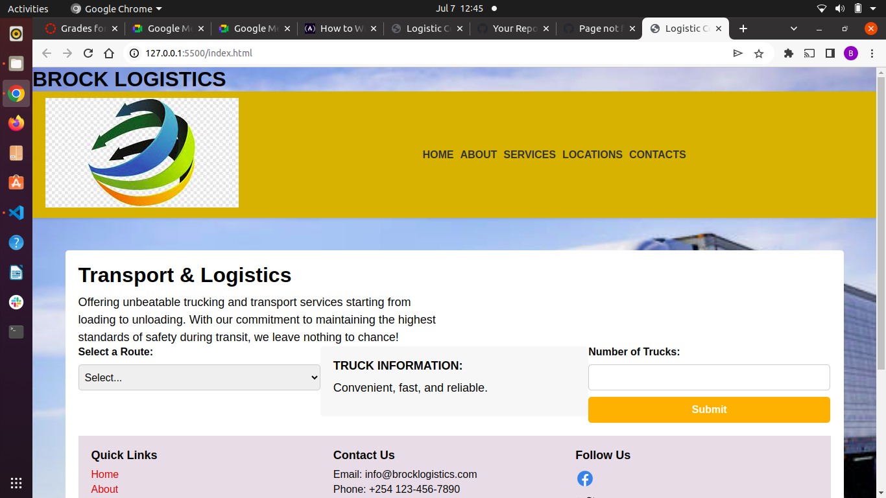

# Project Name
BROCK LOGISTICS LTD
Created by BRIAN KIBET ON 6/7/2023

## LINKS 
# https://brock-logistics.onrender.com
# https://github.com/kibetbrayo/BROCK-LOGISTICS-LTD
## Description
The Trailer API project provides a RESTful API for accessing information about trailers. It allows users to retrieve data related to trailers, such as their specifications, availability, and other relevant details.

The customer is able to 
Select a route
Select the number of trailers  
To see the days of transit
Able to book a truck available

brock logistics website will be able to be helfull to the customers whwn booking and help him to know when the shippmennt will arrive
## Installation
Clone the repository: git clone https://github.com/kibetbrayo/BROCK-LOGISTICS-LTD
Navigate to the project directory: cd trailer-api
Install dependencies: npm install
Start the server: npm start

### Usage
Once the server is up and running, you can access the API endpoints to interact with the trailer data. Here are some example endpoints:
GET /trailers: Retrieve all trailers.
GET /trailers/:id: Retrieve a specific trailer by ID.
POST /trailers: Create a new trailer.
PUT /trailers/:id: Update an existing trailer by ID.
DELETE /trailers/:id: Delete a trailer by ID.
Replace :id with the actual ID of the trailer you want to retrieve, update, or delete.
Make sure to include any necessary headers or parameters as required by the API endpoints.

## Technologies Used
Node.js
Java script
styles.css
Other dependencies (listed in package.json)

## Screenshots Of  brock websites

- Homepage

  

- Route menudropdown Details

  

- Route details

  

- Prompt messages

  

## Known Bugs

So far so good there are no bugs related to this project 😎
Contributions to this project are welcome. If you find any issues or have suggestions for improvements, please feel free to open an issue or submit a pull request.

## Contact me @
- Email: kibetbrian4645@gmail.com

## License

Copyright (c) 2023 Kibet Brian.

Permission is hereby granted, free of charge, to any person obtaining a copy
of this software and associated documentation files , to deal
in the Software without restriction, including without limitation the rights
to use, copy, modify, merge, publish, distribute, sublicense, and/or sell
copies of the Software, and to permit persons to whom the Software is
furnished to do so, subject to the following conditions:

The above copyright notice and this permission notice shall be included in all
copies or substantial portions of the Software.

THE SOFTWARE IS PROVIDED "AS IS", WITHOUT WARRANTY OF ANY KIND, EXPRESS OR
IMPLIED, INCLUDING BUT NOT LIMITED TO THE WARRANTIES OF MERCHANTABILITY,
FITNESS FOR A PARTICULAR PURPOSE AND NONINFRINGEMENT. IN NO EVENT SHALL THE
AUTHORS OR COPYRIGHT HOLDERS BE LIABLE FOR ANY CLAIM, DAMAGES OR OTHER
LIABILITY, WHETHER IN AN ACTION OF CONTRACT, TORT OR OTHERWISE, ARISING FROM,
OUT OF OR IN CONNECTION WITH THE SOFTWARE OR THE USE OR OTHER DEALINGS IN THE
SOFTWARE.

